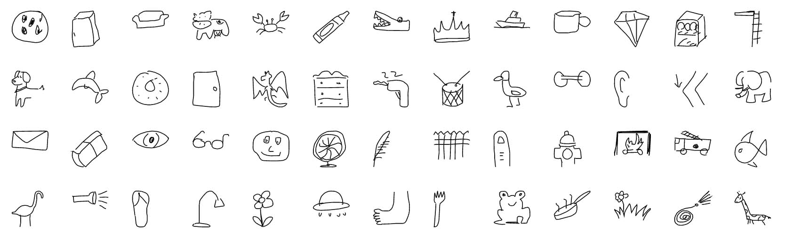

# The Quick, Draw! Dataset


The Quick Draw Dataset is a collection of 50 million drawings across [345 categories](categories.txt), contributed by players of the game [Quick, Draw!](https://quickdraw.withgoogle.com). The drawings were captured as timestamped vectors, tagged with metadata including what the player was asked to draw and in which country the player was located. You can browse the recognized drawings on [quickdraw.withgoogle.com/data](https://quickdraw.withgoogle.com/data).

We're sharing them here for developers, researchers, and artists to explore, study, and learn from. If you create something with this dataset, please let us know [by e-mail](mailto:quickdraw-support@google.com) or at [A.I. Experiments](https://aiexperiments.withgoogle.com/submit).

We have also released a tutorial and model for training your own drawing classifier on [tensorflow.org](https://github.com/tensorflow/docs/blob/master/site/en/r1/tutorials/sequences/recurrent_quickdraw.md).

Please keep in mind that while this collection of drawings was individually moderated, it may still contain inappropriate content.

## Content
- [The raw moderated dataset](#the-raw-moderated-dataset)
- [Preprocessed dataset](#preprocessed-dataset)
- [Get the data](#get-the-data)
- [Projects using the dataset](#projects-using-the-dataset)
- [Changes](#changes)
- [License](#license)


## The raw moderated dataset
The raw data is available as [`ndjson`](http://ndjson.org/) files seperated by category, in the following format: 

| Key          | Type                   | Description                                  |
| ------------ | -----------------------| -------------------------------------------- |
| key_id       | 64-bit unsigned integer| A unique identifier across all drawings.     |
| word         | string                 | Category the player was prompted to draw.    |
| recognized   | boolean                | Whether the word was recognized by the game. |
| timestamp    | datetime               | When the drawing was created.                |
| countrycode  | string                 | A two letter country code ([ISO 3166-1 alpha-2](https://en.wikipedia.org/wiki/ISO_3166-1_alpha-2)) of where the player was located. |
| drawing      | string                 | A JSON array representing the vector drawing |  


Each line contains one drawing. Here's an example of a single drawing:

```javascript
  { 
    "key_id":"5891796615823360",
    "word":"nose",
    "countrycode":"AE",
    "timestamp":"2017-03-01 20:41:36.70725 UTC",
    "recognized":true,
    "drawing":[[[129,128,129,129,130,130,131,132,132,133,133,133,133,...]]]
  }
```

The format of the drawing array is as following:
 
```javascript
[ 
  [  // First stroke 
    [x0, x1, x2, x3, ...],
    [y0, y1, y2, y3, ...],
    [t0, t1, t2, t3, ...]
  ],
  [  // Second stroke
    [x0, x1, x2, x3, ...],
    [y0, y1, y2, y3, ...],
    [t0, t1, t2, t3, ...]
  ],
  ... // Additional strokes
]
```

Where `x` and `y` are the pixel coordinates, and `t` is the time in milliseconds since the first point. `x` and `y` are real-valued while `t` is an integer. The raw drawings can have vastly different bounding boxes and number of points due to the different devices used for display and input.

## Preprocessed dataset
We've preprocessed and split the dataset into different files and formats to make it faster and easier to download and explore.

#### Simplified Drawing files (`.ndjson`)
We've simplified the vectors, removed the timing information, and positioned and scaled the data into a 256x256 region. The data is exported in [`ndjson`](http://ndjson.org/) format with the same metadata as the raw format. The simplification process was:

1. Align the drawing to the top-left corner, to have minimum values of 0.
2. Uniformly scale the drawing, to have a maximum value of 255. 
3. Resample all strokes with a 1 pixel spacing.
4. Simplify all strokes using the [Ramer–Douglas–Peucker algorithm](https://en.wikipedia.org/wiki/Ramer%E2%80%93Douglas%E2%80%93Peucker_algorithm) with an epsilon value of 2.0.

There is an example in [examples/nodejs/simplified-parser.js](examples/nodejs/simplified-parser.js) showing how to read ndjson files in NodeJS.  
Additionally, the [examples/nodejs/ndjson.md](examples/nodejs/ndjson.md) document details a set of command-line tools that can help explore subsets of these quite large files.

#### Binary files (`.bin`)
The simplified drawings and metadata are also available in a custom binary format for efficient compression and loading.

There is an example in [examples/binary_file_parser.py](examples/binary_file_parser.py) showing how to load the binary files in Python.  
There is also an example in [examples/nodejs/binary-parser.js](examples/nodejs/binary-parser.js) showing how to read the binary files in NodeJS.

#### Numpy bitmaps (`.npy`)
All the simplified drawings have been rendered into a 28x28 grayscale bitmap in numpy `.npy` format. The files can be loaded with [`np.load()`](https://docs.scipy.org/doc/numpy-1.12.0/reference/generated/numpy.load.html). These images were generated from the simplified data, but are aligned to the center of the drawing's bounding box rather than the top-left corner. [See here for code snippet used for generation](https://github.com/googlecreativelab/quickdraw-dataset/issues/19#issuecomment-402247262).

## Get the data
The dataset is available on Google Cloud Storage as [`ndjson`](http://ndjson.org/) files seperated by category. See the list of files in [Cloud Console](https://console.cloud.google.com/storage/quickdraw_dataset/), or read more about [accessing public datasets](https://cloud.google.com/storage/docs/access-public-data) using other methods. As an example, to easily download all simplified drawings, one way is to run the command `gsutil -m cp 'gs://quickdraw_dataset/full/simplified/*.ndjson' .` 

#### Full dataset seperated by categories
- [Raw files](https://console.cloud.google.com/storage/quickdraw_dataset/full/raw) (`.ndjson`)
- [Simplified drawings files](https://console.cloud.google.com/storage/quickdraw_dataset/full/simplified) (`.ndjson`)
- [Binary files](https://console.cloud.google.com/storage/quickdraw_dataset/full/binary) (`.bin`)
- [Numpy bitmap files](https://console.cloud.google.com/storage/quickdraw_dataset/full/numpy_bitmap) (`.npy`)

#### Sketch-RNN QuickDraw Dataset
This data is also used for training the [Sketch-RNN](https://arxiv.org/abs/1704.03477) model.  An open source, TensorFlow implementation of this model is available in the [Magenta Project](https://magenta.tensorflow.org/sketch_rnn), (link to GitHub [repo](https://github.com/tensorflow/magenta/tree/master/magenta/models/sketch_rnn)).  You can also read more about this model in this Google Research [blog post](https://research.googleblog.com/2017/04/teaching-machines-to-draw.html).  The data is stored in compressed `.npz` files, in a format suitable for inputs into a recurrent neural network.

In this dataset, 75K samples (70K Training, 2.5K Validation, 2.5K Test) has been randomly selected from each category, processed with [RDP](https://en.wikipedia.org/wiki/Ramer%E2%80%93Douglas%E2%80%93Peucker_algorithm) line simplification with an `epsilon` parameter of 2.0.  Each category will be stored in its own `.npz` file, for example, `cat.npz`.

We have also provided the full data for each category, if you want to use more than 70K training examples.  These are stored with the `.full.npz` extensions.

- [Numpy .npz files](https://console.cloud.google.com/storage/quickdraw_dataset/sketchrnn)

*Note:* For Python3, loading the `npz` files using `np.load(data_filepath, encoding='latin1', allow_pickle=True)`

Instructions for converting Raw `ndjson` files to this `npz` format is available in this [notebook](https://github.com/hardmaru/quickdraw-ndjson-to-npz).

## Projects using the dataset
Here are some projects and experiments that are using or featuring the dataset in interesting ways. Got something to add? [Let us know!](mailto:quickdraw-support@google.com)

*Creative and artistic projects*

- [Letter collages](http://frauzufall.de/en/2017/google-quick-draw/) by [Deborah Schmidt](http://frauzufall.de/)
- [Face tracking experiment](https://www.instagram.com/p/BUU8TuQD6_v/) by [Neil Mendoza](http://www.neilmendoza.com/)
- [Faces of Humanity](http://project.laboiteatortue.com/facesofhumanity/) by [Tortue](www.laboiteatortue.com)
- [Infinite QuickDraw](https://kynd.github.io/infinite_quickdraw/) by [kynd.info](http://kynd.info)
- [Misfire.io](http://misfire.io/) by Matthew Collyer
- [Draw This](http://danmacnish.com/2018/07/01/draw-this/) by [Dan Macnish](http://danmacnish.com/)
- [Scribbling Speech](http://xinyue.de/scribbling-speech.html) by [Xinyue Yang](http://xinyue.de/)
- [illustrAItion](http://www.illustraition.net/) by [Ling Chen](https://github.com/lingchen42/illustrAItion)
- [Dreaming of Electric Sheep](https://medium.com/@libreai/dreaming-of-electric-sheep-d1aca32545dc) by [
Dr. Ernesto Diaz-Aviles](http://ernesto.diazaviles.com/)

*Data analyses*

- [How do you draw a circle?](https://qz.com/994486/the-way-you-draw-circles-says-a-lot-about-you/) by [Quartz](https://qz.com/)
- [Forma Fluens](http://formafluens.io/) by [Mauro Martino](http://www.mamartino.com/), [Hendrik Strobelt](http://hendrik.strobelt.com/) and [Owen Cornec](http://www.byowen.com/)
- [How Long Does it Take to (Quick) Draw a Dog?](http://vallandingham.me/quickdraw/) by [Jim Vallandingham](http://vallandingham.me/)
- [Finding bad flamingo drawings with recurrent neural networks](http://colinmorris.github.io/blog/bad_flamingos) by [Colin Morris](http://colinmorris.github.io/)
- [Facets Dive x Quick, Draw!](https://pair-code.github.io/facets/quickdraw.html) by [People + AI Research Initiative (PAIR), Google](https://ai.google/pair)
- [Exploring and Visualizing an Open Global Dataset](https://research.googleblog.com/2017/08/exploring-and-visualizing-open-global.html) by Google Research
- [Machine Learning for Visualization](https://medium.com/@enjalot/machine-learning-for-visualization-927a9dff1cab) - Talk / article by Ian Johnson

*Papers*
- [A Neural Representation of Sketch Drawings](https://arxiv.org/pdf/1704.03477.pdf) by [David Ha](https://scholar.google.com/citations?user=J1j92GsxVUMC&hl=en), [Douglas Eck](https://scholar.google.com/citations?user=bLb3VdIAAAAJ&hl=en), ICLR 2018. [code](https://github.com/tensorflow/magenta/tree/master/magenta/models/sketch_rnn)
- [Sketchmate: Deep hashing for million-scale human sketch retrieval](http://openaccess.thecvf.com/content_cvpr_2018/papers/Xu_SketchMate_Deep_Hashing_CVPR_2018_paper.pdf) by [Peng Xu](http://www.pengxu.net/) et al., CVPR 2018.
- [Multi-graph transformer for free-hand sketch recognition](https://arxiv.org/pdf/1912.11258.pdf) by [Peng Xu](http://www.pengxu.net/), [Chaitanya K Joshi](https://chaitjo.github.io/), [Xavier Bresson](https://www.ntu.edu.sg/home/xbresson/), ArXiv 2019. [code](https://github.com/PengBoXiangShang/multigraph_transformer)
- [Deep Self-Supervised Representation Learning for Free-Hand Sketch](https://arxiv.org/pdf/2002.00867.pdf) by [Peng Xu](http://www.pengxu.net/) et al., ArXiv 2020. [code](https://github.com/zzz1515151/self-supervised_learning_sketch)
- [SketchTransfer: A Challenging New Task for Exploring Detail-Invariance and the Abstractions Learned by Deep Networks](https://arxiv.org/pdf/1912.11570.pdf) by [Alex Lamb](https://sites.google.com/view/alexmlamb), [Sherjil Ozair](https://sherjilozair.github.io/), [Vikas Verma](https://scholar.google.com/citations?user=wo_M4uQAAAAJ&hl=en), [David Ha](https://scholar.google.com/citations?user=J1j92GsxVUMC&hl=en), WACV 2020.
- [Deep Learning for Free-Hand Sketch: A Survey](https://arxiv.org/pdf/2001.02600.pdf) by [Peng Xu](http://www.pengxu.net/), ArXiv 2020.
- [A Novel Sketch Recognition Model based on Convolutional Neural Networks](https://ieeexplore.ieee.org/document/9152911) by [Abdullah Talha Kabakus](https://www.linkedin.com/in/talhakabakus), 2nd International Congress on Human-Computer Interaction, Optimization and Robotic Applications, pp. 101-106, 2020.

*Guides & Tutorials*
- [TensorFlow tutorial for drawing classification](https://github.com/tensorflow/docs/blob/master/site/en/r1/tutorials/sequences/recurrent_quickdraw.md)
- [Train a model in tf.keras with Colab, and run it in the browser with TensorFlow.js](https://medium.com/tensorflow/train-on-google-colab-and-run-on-the-browser-a-case-study-8a45f9b1474e) by Zaid Alyafeai

*Code and tools*
- [Quick, Draw! Polymer Component & Data API](https://github.com/googlecreativelab/quickdraw-component) by Nick Jonas
- [Quick, Draw for Processing](https://github.com/codybenlewis/Quick-Draw-for-Processing) by [Cody Ben Lewis](https://twitter.com/CodyBenLewis)
- [Quick, Draw! prediction model](https://github.com/keisukeirie/quickdraw_prediction_model) by Keisuke Irie 
- [Random sample tool](http://learning.statistics-is-awesome.org/draw/) by [Learning statistics is awesome](http://learning.statistics-is-awesome.org/)
- [SVG rendering in d3.js example](https://bl.ocks.org/enjalot/a2b28f0ed18b891f9fb70910f1b8886d) by [Ian Johnson](http://enja.org/) (read more about the process [here](https://gist.github.com/enjalot/54c4342eb7527ea523884dbfa52d174b))
- [Sketch-RNN Classification](https://github.com/payalbajaj/sketch_rnn_classification) by Payal Bajaj
- [quickdraw.js](https://github.com/wagenaartje/quickdraw.js) by Thomas Wagenaar
- [~ Doodler ~](https://github.com/krishnasriSomepalli/cs50-project/) by [
Krishna Sri Somepalli](https://krishnasrisomepalli.github.io/)
- [quickdraw Python API](http://quickdraw.readthedocs.io) by [Martin O'Hanlon](https://github.com/martinohanlon)
- [RealTime QuickDraw](https://github.com/akshaybahadur21/QuickDraw) by [Akshay Bahadur](http://akshaybahadur.com/)
- [DataFlow processing](https://github.com/gxercavins/dataflow-samples/tree/master/quick-draw) by Guillem Xercavins 
- [QuickDrawGH Rhino Plugin](https://www.food4rhino.com/app/quickdrawgh) by [James Dalessandro](https://github.com/DalessandroJ)


## Changes

May 25, 2017: Updated Sketch-RNN QuickDraw dataset, created `.full.npz` complementary sets.

## License
This data made available by Google, Inc. under the [Creative Commons Attribution 4.0 International license.](https://creativecommons.org/licenses/by/4.0/)

## Dataset Metadata
The following table is necessary for this dataset to be indexed by search
engines such as <a href="https://g.co/datasetsearch">Google Dataset Search</a>.
<div itemscope itemtype="http://schema.org/Dataset">
<table>
  <tr>
    <th>property</th>
    <th>value</th>
  </tr>
  <tr>
    <td>name</td>
    <td><code itemprop="name">The Quick, Draw! Dataset</code></td>
  </tr>
  <tr>
    <td>alternateName</td>
    <td><code itemprop="alternateName">Quick Draw Dataset</code></td>
  </tr>
  <tr>
    <td>alternateName</td>
    <td><code itemprop="alternateName">quickdraw-dataset</code></td>
  </tr>
  <tr>
    <td>url</td>
    <td><code itemprop="url">https://github.com/googlecreativelab/quickdraw-dataset</code></td>
  </tr>
  <tr>
    <td>sameAs</td>
    <td><code itemprop="sameAs">https://github.com/googlecreativelab/quickdraw-dataset</code></td>
  </tr>
  <tr>
    <td>description</td>
    <td><code itemprop="description">The Quick Draw Dataset is a collection of 50 million drawings across 345 categories, contributed by players of the game "Quick, Draw!". The drawings were captured as timestamped vectors, tagged with metadata including what the player was asked to draw and in which country the player was located.\n
\n
Example drawings:
</code></td>
  </tr>
  <tr>
    <td>provider</td>
    <td>
      <div itemscope itemtype="http://schema.org/Organization" itemprop="provider">
        <table>
          <tr>
            <th>property</th>
            <th>value</th>
          </tr>
          <tr>
            <td>name</td>
            <td><code itemprop="name">Google</code></td>
          </tr>
          <tr>
            <td>sameAs</td>
            <td><code itemprop="sameAs">https://en.wikipedia.org/wiki/Google</code></td>
          </tr>
        </table>
      </div>
    </td>
  </tr>
  <tr>
    <td>license</td>
    <td>
      <div itemscope itemtype="http://schema.org/CreativeWork" itemprop="license">
        <table>
          <tr>
            <th>property</th>
            <th>value</th>
          </tr>
          <tr>
            <td>name</td>
            <td><code itemprop="name">CC BY 4.0</code></td>
          </tr>
          <tr>
            <td>url</td>
            <td><code itemprop="url">https://creativecommons.org/licenses/by/4.0/</code></td>
          </tr>
        </table>
      </div>
    </td>
  </tr>
</table>
</div>
